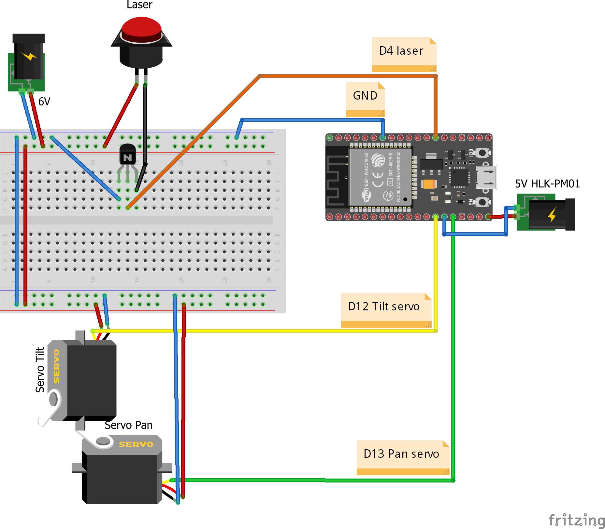

# laserPointer

This project will be about driving 2 servos and 1 laser using a esp32 and a power supply to to point to parts or tools, I own around my garage. This project will be connected to another project called [GParts](https://github.com/guttih/gparts) which is also located on this github space.

## Wiring

__How to connect a 6V laser to esp32 and and be able to control it's brightness__
 - BC337 Base (middle pin) to ESP32 D4
 - BC337 Collector to GND
 - BC337 Emitter to Laser GND 
 - Laser VCC wire to 6V

 
Parts used in the project
 - [Laser 650nm 5mW Red Cross]
 - Two pieces [Servo motor RDS3225]
 - [ESP32 Development Board ]
 - [Power supply 6V - 6A]
 - [HLK-PM01 5V]
 - [BC337 -25 Transistor]

#### Wiring diagram
```
GND                                      +6V
 ├──────────────────────┐                 │
 |        ╔═══════════╗ |                 │
 |        ║  -BC337-  ║ |    ╔═════════╗  |
 |        ║           ║ |    ║ -Laser- ║  │
 |        ║ Collector ╟─┘    ║         ║  │
 |  ┌─────╢ Base      ║      ║     VCC ╟──┤
 |  │     ║ Emitter   ╟──────╢ GND     ║  │
 |  │     ╚═══════════╝      ╚═════════╝  │
 |  │     ╔═══════════╗     ╔══════════╗  │
 │  │     ║  -ESP32-  ║     ║-HLK-PM01-║  │
 |  │     ║           ║     ║          ║  │
 │  │ GND ║ 3V3   VIN ╟─────╢ +Vo (+5V)║  │
 │  │  ╧ ─╢ GND   GND ╟─────╢ -Vo      ║  │
 │  └─────╢ D4        ║     ╚══════════╝  │
 |      ┌─╢ D13   D12 ╟─┐ ┌───── GND      │
 |      │ ║           ║ | |       ╧       │
 |      │ ╚═══════════╝ | | ╔══════════╗  │
 |      │ ╔══════════╗  | | ║ -Servo2- ║  │
 |      │ ║ -Servo1- ║  | | ║          ║  │
 |      │ ║          ║  | └─╢ GND      ║  │
 |      └─╢ Signal   ║  └───╢ Signal   ║  │
 |        ║      VCC ╟──┐   ║      VCC ╟──┤
 └────────╢ GND      ║  |   ╚══════════╝  │
          ╚══════════╝  └─────────────────┘
```

#### Breadboard drawing


The [image](docs/wiringLaserPointer.png) is based on 
[this document](docs/wiringLaserPointer.fzz) which was drawn in 
[fritzing](https://fritzing.org).

--------------------------------------------------------------------------------
## Available http commands

In examples let's assume the esp32 has been issued the ip address 192.168.1.231
on your local network.
### Move
Method: HTTP GET.


__Move__ accepts four query parameters
 - __tilt__ is a _Required_ parameter for how much in degrees the tower should
    be tilted (up/down position).
    - Valid values: 0 - 264.
 - __pan__ is a _Required_ parameter for how much in degrees the tower should
    be paned (left/right position).
    - Valid values: 0 - 255
 - __laser__ is a _Optional_ parameter for how bright the laser should be where
    255 is full on and 0 if off.
    - Valid values: 0 - 255 
 - __blink__ is a _Optional_ parameter how many milliseconds should pass before
    blinking.  Pass 0 to turn blinking off. Pass 3500 to make the laser blink
    every 3.5 seconds.
    - Valid values:  0 - 2147483647

Example query
  - `http://192.168.1.231:5100/move?tilt=101&pan=148&laser=255&blink=1000`


### Set
Method: HTTP GET.


__Set__ accepts two query parameters
 - __laser__ is a _Optional_ parameter for how bright the laser should be where
    255 is full on and 0 if off.
    - Valid values: 0 - 255 
 - __blink__ is a _Optional_ parameter how many milliseconds should pass before
    blinking.  Pass 0 to turn blinking off. Pass 3500 to make the laser blink
    every 3.5 seconds.
    - Valid values:  0 - 2147483647

Example query
  - `http://192.168.1.231:5100/set?laser=255&blink=3000`
--------------------------------------------------------------------------------
## Development

To upload this program firmware over the air (OTA) change the `upload-port` to **3232**.  To upload this program firmware using usb change the `upload-port` to something like **COM6**, that is if you computer gave the esp32 usb connection the name COM6.

 

 -------------------------------------------------------------------------------

 [Laser 650nm 5mW Red Cross]:https://www.aliexpress.com/item/32870666247.html?spm=a2g0s.12269583.0.0.7be313f4OIyWvS
 [Servo motor RDS3225]:https://www.aliexpress.com/item/4000943153775.html?spm=a2g0s.12269583.0.0.701745b71zAQGI
 [ESP32 Development Board]:https://www.aliexpress.com/item/32839311668.html?spm=a2g0s.9042311.0.0.27424c4dYD8HnK
[Power supply 6V - 6A]:https://www.aliexpress.com/item/4000102102421.html?spm=a2g0s.12269583.0.0.4f644eccTkOI4c
[HLK-PM01 5V]:https://www.aliexpress.com/item/32504127465.html?spm=a2g0s.9042311.0.0.27424c4dOggB1n
[BC337 -25 Transistor]:https://www.aliexpress.com/item/32695375311.html?spm=a2g0o.productlist.0.0.5cec1feege9pS5&algo_pvid=b4308ab3-09f9-4f89-8457-5588164ae41f&algo_expid=b4308ab3-09f9-4f89-8457-5588164ae41f-0&btsid=0b0a556e16214673889264737ee796&ws_ab_test=searchweb0_0,searchweb201602_,searchweb201603_